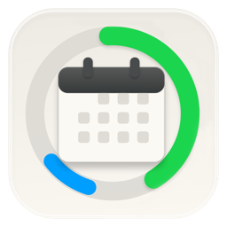
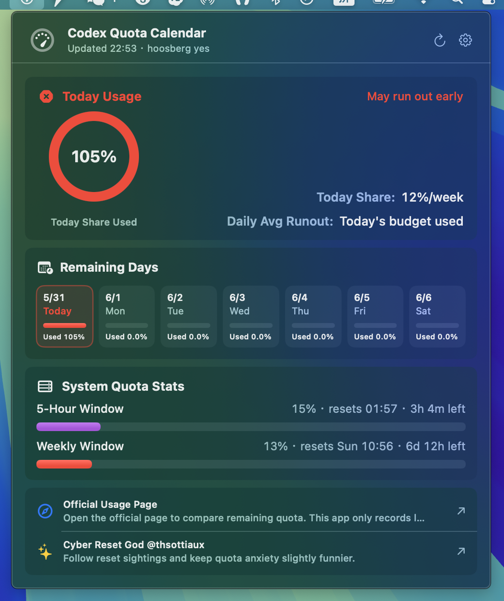

<p align="center">
  
</p>

<h1 align="center">Codex Quota Calendar</h1>

<p align="center">
  <strong>A quiet macOS menu bar calendar for your Codex quota rhythm.</strong>
  <br>
  Daily share · weekly remaining quota · local history · notarized DMG
  <br>
  <a href="https://hooosberg.github.io/QuotaCalendar/">Official Website</a> ·
  <a href="README.zh-CN.md">简体中文</a> ·
  <a href="https://github.com/hooosberg/QuotaCalendar/releases/latest">Download</a>
</p>

<p align="center">
  
  
  
  
</p>

<p align="center">
  <a href="https://hooosberg.github.io/QuotaCalendar/">
    
  </a>
</p>

> **Download:** [latest notarized DMG](https://github.com/hooosberg/QuotaCalendar/releases/latest)  
> Codex Quota Calendar is an independent utility and is not affiliated with OpenAI.

Codex Quota Calendar turns the moving target of Codex usage into a small local rhythm: how much of today's fair share has been used, how many days remain in the current weekly window, and whether the current pace is comfortable or likely to run out early.

It lives in the macOS menu bar. No server. No analytics. No account switching. Your auth token is read from and stored only on your Mac.

## Why

Codex quota is easier to understand as a calendar than as a raw percentage.

- **Today:** how much of today's average share has been used.
- **This week:** how much weekly quota remains and when it resets.
- **Pace:** a smoothed estimate using recent local samples, so the app can still estimate speed when the latest polling cycle has not moved yet.
- **History:** a tiny rolling local log keeps recent quota checkpoints bounded in size.

## Features

- Menu bar app built with SwiftUI.
- Daily-share progress ring and remaining-days cards.
- Weekly and 5-hour quota stats.
- Local rolling quota history for smoother speed and runout estimates.
- 10-minute refresh cadence.
- 12 UI languages.
- Notarized Developer ID DMG with drag-to-Applications installer.
- One-click links to the official usage page and release updates.

## Privacy

| Item | Behavior |
|---|---|
| Account | Uses local Codex auth data only |
| Token storage | Local Mac only |
| App server | None |
| Analytics | None |
| Third-party tracking | None |
| Quota history | Local rolling log, bounded in size |

Full text: [Privacy](privacy.html)

## Install

1. Download the latest DMG from [Releases](https://github.com/hooosberg/QuotaCalendar/releases/latest).
2. Open the DMG.
3. Drag **Codex Quota Calendar** into **Applications**.
4. Launch it from Applications or Launchpad.

The release DMG is Developer ID signed, notarized by Apple, and stapled.

## Build From Source

Requirements:

- macOS 14+
- Xcode command line tools
- Swift 6.2+

Run locally:

```bash
./script/build_and_run.sh
```

Run tests:

```bash
swift test
```

Build a local signed release if you have a Developer ID certificate and notary credentials:

```bash
./script/package_release.sh --notarize
```

Release credentials must stay in environment variables or ignored local files. See [docs/release.md](docs/release.md).

## Repository Layout

```text
.
├── Sources/QuotaCalendar/      SwiftUI app source
├── Tests/QuotaCalendarTests/   Unit tests
├── script/                     Build, icon, DMG, signing, notarization scripts
├── docs/                       Release notes and packaging docs
├── assets/                     Website and README media
├── index.html                  GitHub Pages landing page
└── privacy.html                Privacy page
```

## Security Notes

This repository intentionally excludes:

- `.env*`
- Apple ID app-specific passwords
- App Store Connect API keys
- `.p8`, `.p12`, `.cer`, and provisioning files
- built DMGs and local release output

If you find a secret in the repository, please open a private security report or email [zikedece@proton.me](mailto:zikedece@proton.me).

## Developer

Built by [hooosberg](https://github.com/hooosberg).

Contact: [zikedece@proton.me](mailto:zikedece@proton.me)
